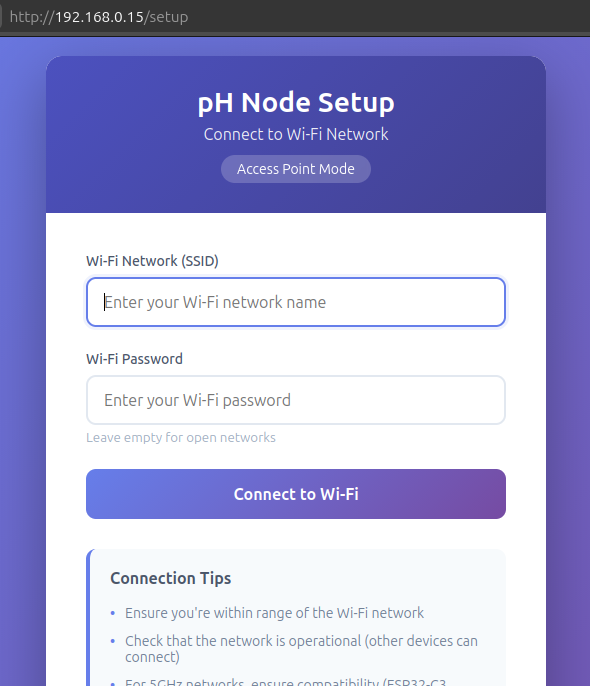
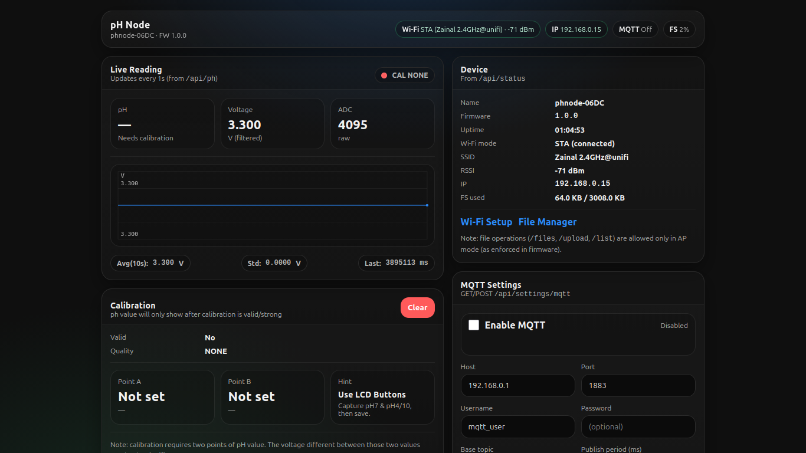

ESP32 pH Node (Web UI + MQTT)
============================

A standalone ESP32-based pH monitoring node with:

- Captive-portal Wi-Fi provisioning (ap.html)
- Modern real-time dashboard (index.html)
- Local LCD + button-based calibration
- JSON REST APIs
- Optional MQTT publishing (Home Assistant friendly)
- LittleFS web file manager

------------------------------------------------------------

FEATURES
--------
- Wi-Fi AP fallback for first-time setup
  


- Web UI



- Physical-button pH calibration (safe & deliberate)
- Live ADC, voltage, and pH display
- Voltage trend chart
- MQTT publishing configurable via Web UI
- Clean modular ESP32 firmware architecture
- LittleFS file manager (AP mode only)

------------------------------------------------------------

PROJECT STRUCTURE
-----------------
```
.
├── main.cpp
├── data/
│   ├── index.html
│   └── ap.html
├── platformio.ini
└── README.txt
```
------------------------------------------------------------

WEB INTERFACES
--------------

Wi-Fi Provisioning (ap.html)
- Activated automatically when no Wi-Fi is saved
- ESP32 creates AP (default IP: 192.168.4.1)
- Used only for Wi-Fi setup

Main Dashboard (index.html)
- Access via: http://<ESP32-IP>/
- Displays pH, voltage, ADC, calibration status, device info, MQTT state

------------------------------------------------------------

CALIBRATION WORKFLOW (BUTTON-BASED)
----------------------------------
1. Power on device
2. Enter CAL mode via buttons
3. Insert probe into pH 7 buffer → capture
4. Insert probe into pH 4 or pH 10 buffer → capture
5. Calibration quality evaluated automatically

Web UI shows:
- CAL OK
- CAL WEAK
- CAL NONE

------------------------------------------------------------

MQTT SUPPORT
------------
MQTT is optional and configured entirely from the Web UI.

Configurable:
- Enable / Disable MQTT
- Broker host & port
- Username / password (optional)
- Base topic
- Publish interval
- Retain flag

------------------------------------------------------------

MQTT TOPICS (EXAMPLE)
--------------------
Base topic: phnode
```
phnode/<device>/ph
phnode/<device>/voltage
phnode/<device>/adc
phnode/<device>/status
phnode/<device>/cal
```
Example payload:
```
{
  "ph": 6.87,
  "voltage": 2.314,
  "adc": 2876,
  "cal": "OK"
}
```
------------------------------------------------------------

HOME ASSISTANT (MQTT)
--------------------
In Home Assistant:
1. Create mqtt_user Settings > People > Add Person
2. Give proper, Allow login, Set Password
3. Create integration Settings > Devices & Services > Integrations > Add integration > MQTT

After adding the MQTT card

4. Listen to Topic: Settings > Devices & Services > Integrations > MQTT
  - Click Configure (gear button)
  - Go to "Listen to a topic card"
  - Enable Format JSON content
  - Type: phnode/#
  - Start listening (if message is appeared. Great!!)
  - Example Messages:
    ```
    Message 9 received on phnode/phnode-06DC/telemetry at 11:05 AM:
    {
        "ts_ms": 1577248,
        "adc": 3366,
        "v": 2.708141327,
        "ph": 2.896392822,
        "cal": "OK"
    }
    ```
  - Remember/write down the topic
  - Looking at the example, the topic is: phnode/phnode-06DC/telemetry
    
5. + Add MQTT devices and follow HA instruction.

Note:
- MQTT Auto Discovery is NOT used by design

------------------------------------------------------------

REST API ENDPOINTS
-----------------
```
/api/status
/api/ph
/api/cal
/api/cal/clear
/api/settings/mqtt
/files (AP mode only)
```
------------------------------------------------------------

BUILD & FLASH
-------------
Recommended: PlatformIO
```
pio run
pio run --target upload
pio run --target uploadfs
```
------------------------------------------------------------

Free for education, research, and commercial use.
